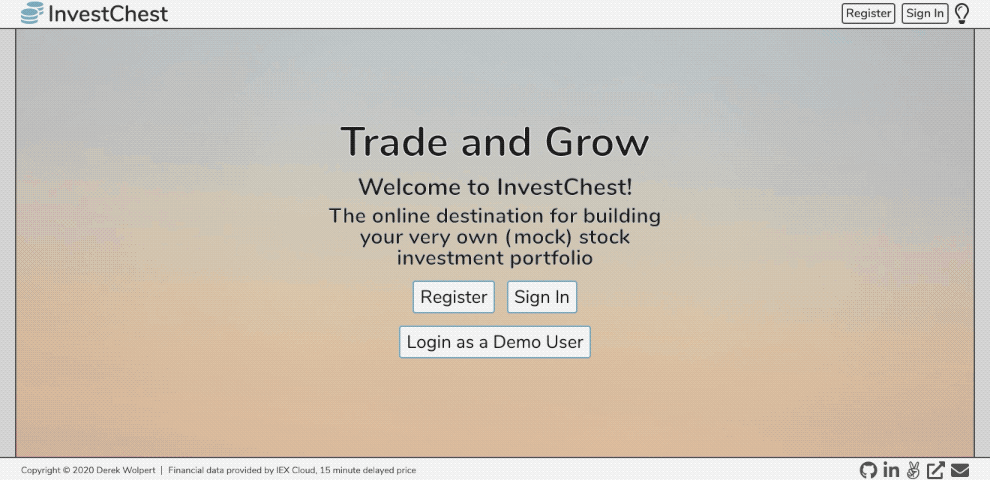

# InvestChest

## Overview

InvestChest was completed as a part of the Winter 2020 assessment for the NYC Tech Talent Pipeline. The given instructions were to build a full-stack web-based stock portfolio application where users can purchase stock based on values fetched from a third-party API.  The specifics regarding functionality (e.g. user registration, sign-in, purchase forms, portfolio and transaction page, etc.) were detailed ahead of time, as were rough design and styling guidelines (including the wireframe mockups included below).  Otherwise, I was free to utilize tools viewed best fit for the task.

Technologies used include <b>MERN (MongoDB, Express.js, React, Node.js) stack, Redux, Webpack, Sass, CSS3, HTML5, Recharts</b> and the third-party <b>IEX Cloud</b> finance API.  InvestChest is deployed within a <b>Docker Container</b> through <b>Amazon Web Services</b>.

### [This project is currently hosted at <b>investchest.derekwolpert.com</b> - CLICK HERE to visit a live version of this project](https://investchest.derekwolpert.com)

## Architecture & Technologies

- <b>React</b>, a JavaScript library used to assist with efficient management of rapidly changing data and maintaining a single-page web application structure.
- <b>Redux</b>, a JavaScript library used in coordination with React to create a centralized store for organizing and accessing data.
- <b>Express.js</b>, a web application framework, used with Node.js, to provide server-side structure for querying and retrieval of API data.
- <b>Node.js</b>, a runtime environment used to execute JavaScript for server-side scripting.
- <b>JavaScript</b>, the project's front and backend programing language.
- <b>MongoDB</b>, a document-oriented (NoSQL) database system used for storage and management of information.
- <b>Webpack</b>, a JavaScript bundler to assist with development and production builds.
- <b>Sass, CSS3 and HTML5</b>, used to manage the presentation and styling of the project.
- <b>Recharts</b>, a JavaScript library built upon D3.js to assist with data visualization management in a React based project. 
- <b>IEX Cloud</b>, a third-party finance API used to query and receive real-time stock prices.
- <b>Docker</b>, containerization platform that allows the creation of lightweight/portable environments to run the project.
- <b>Amazon Web Services</b>, an on-demand cloud computing platform utilized to assist with storage and deployment of the project (using ECR, ECS and EC2 along with appropriate network configuration).

## Functionality

- Comprehensive registration/authentication behavior for management of user sessions, and keeping track of user information (e.g. available cash, trades association, etc.).
- Error handling for input fields to prevent invalid entries along with appropriate error messages (e.g. prevents users from signing in with incorrect credentials, stops a user from registering an account under a previously used email address, prevent purchase of a stocks that cost more than a user's available cash, etc.).
- Separate Portfolio and Transaction pages. Portfolio page displays an aggregated list of all stocks a user has purchased, and lists in alphabetical order based on stock ticker. If a stock was purchased in two separate transactions then the transactions are grouped together. Transaction page displays a list of each individual trade in reverse-chronological order.
- Color indicators for the pricing information on the Portfolio page to indicate if a user has gained (green) or lost (red) money when comparing how much they've spent on the stock verses it's current price.
- An interactive stock chart, with hover effects, to allow a user to review a stock's history in a selected range before completing a purchase.
- Dynamic and auto-detecting light/dark mode in conjunction with a theme switch in the webpage's header.
- A polished, intuitive, responsive user interface/experience.

    
    

## Folder Structure

    # Backend Directory

    .
    ├── config          # includes access keys, and user auth config
    ├── frontend        # see the frontend directory below
    |   └── ...
    ├── models          # defines the structure of db schema
    ├── readme_images   # images used on this page
    ├── routes
    |   └── api         # set connection btw frontend, backend
    |                       # and db interactions
    └── validation      # checks an instances details before registering
                            # or modifying a db entry   

    # Frontend Directory

    frontend
    ├── dist                    # compiled js and css files
    ├── public                  # publicly accessible files
    |                               # including primary html   
    ├── src
    |   |── actions 
    |   |── components          # react components
    |   |   |── footer
    |   |   |── header
    |   |   |── modal
    |   |   |── portfolio
    |   |   |── purchase
    |   |   |── session
    |   |   |── splash
    |   |   |── stock_chart
    |   |   |── theme_switch
    |   |   └── transactions
    |   |── middleware          # includes a thunk middleware definition
    |   |── reducers            # organizes information for the
    |   |                           # global redux store
    |   |── store               # defines the redux store
    |   └── util                # set api calls to access backend
    └── styles                  # design/styling files

## Wireframe vs. Final Design

    
    

    
    

    
    

    
    

## Potential Future Features

- Implement selling of stocks, which would be included as their own separate entries on the Transaction page
- Enhanced responsiveness for various screen sizes, and mobile presentation optimization
- Enhanced ticker symbol field in the purchase form with predictive values based on valid inputs, allow querying based on company name

## Resources

- The background image for the splash page was taken by César Couto, and was feature on Unsplash: https://unsplash.com/photos/TIvFLeqZ4ec
- The basis for the styling of the loading spinner adapted from Loading.io: https://loading.io/css
- The CSS reset used in this project: https://meyerweb.com/eric/tools/css/reset
- Color selection variables inspired by Base16 default colors: http://chriskempson.com/projects/base16/
